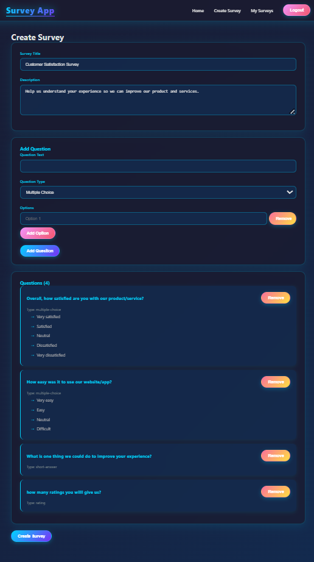
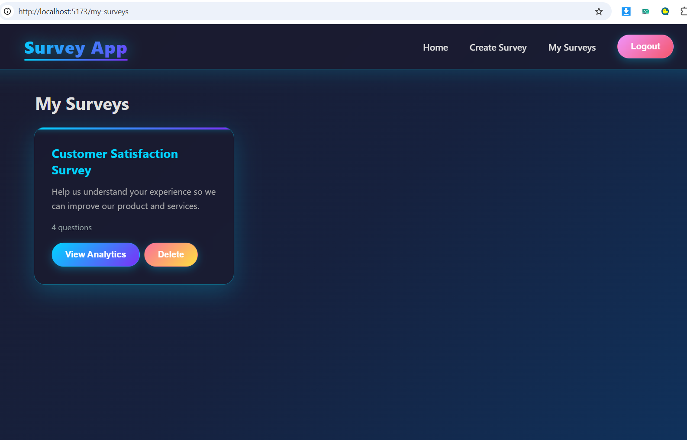
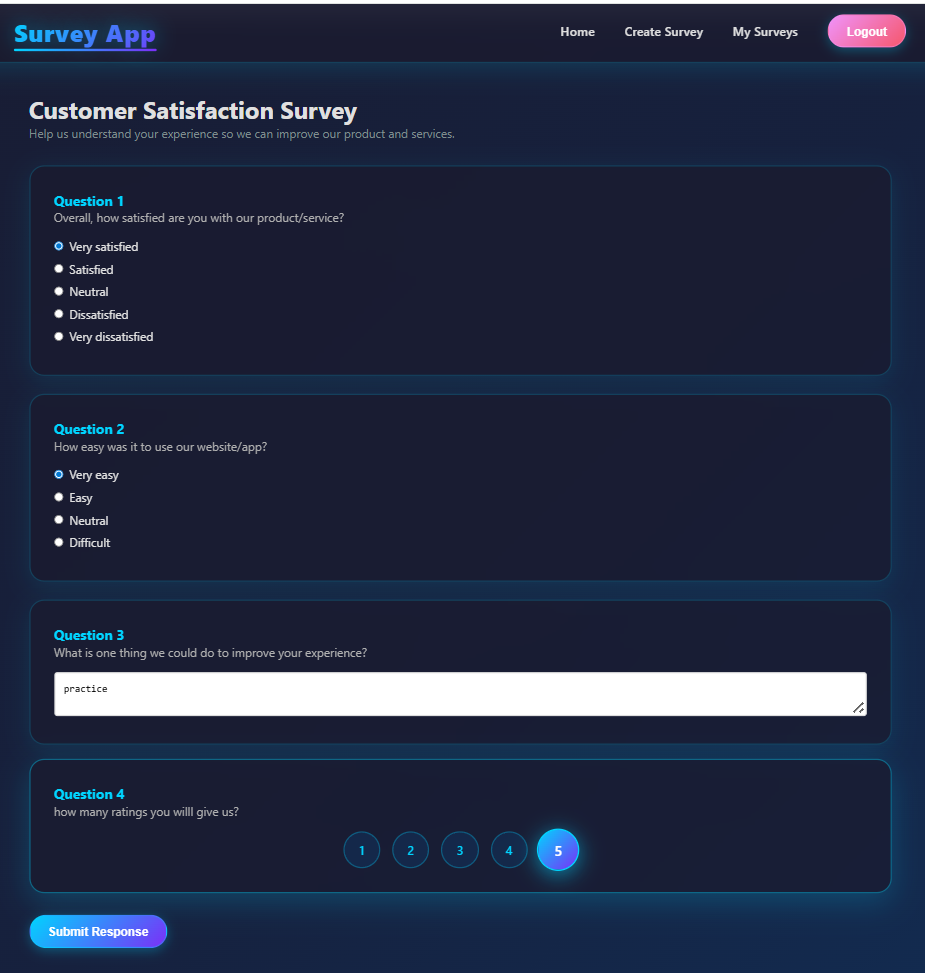
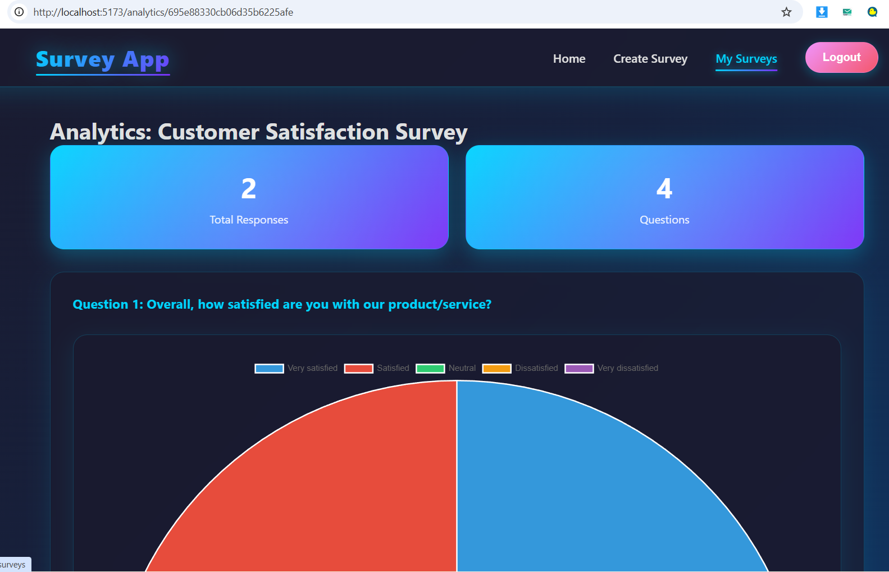

# Survey Application

🚀 **Live Demo**: [https://survey-app-full-stack-node-js.vercel.app/](https://survey-app-full-stack-node-js.vercel.app/)

A full-stack survey and feedback application built with React, Node.js, Express, and MongoDB.

## Screenshots

### Home Page


### Create Survey


### Take Survey


### Analytics Dashboard


## Features

- User authentication with JWT
- Create custom surveys with multiple question types
- Multiple choice, short answer, and rating questions
- Fill out surveys anonymously
- View analytics with charts and graphs
- Real-time response tracking
- Responsive design

## Tech Stack

**Frontend:**
- React with Vite
- React Router for navigation
- Axios for API calls
- Chart.js for data visualization

**Backend:**
- Node.js with Express
- MongoDB with Mongoose
- JWT for authentication
- bcryptjs for password hashing

## Installation

### Prerequisites
- Node.js (v14 or higher)
- MongoDB (local or Atlas)

### Setup

1. Clone the repository
```bash
git clone <your-repo-url>
cd survey-app
```

2. Install server dependencies
```bash
cd server
npm install
```

3. Install client dependencies
```bash
cd ../client
npm install
```

4. Create environment file
Create a `.env` file in the root directory:
```
MONGODB_URI=your_mongodb_connection_string
JWT_SECRET=your_secret_key
PORT=5000
```

### Running Locally

1. Start MongoDB (if running locally)
```bash
mongod
```

2. Start the backend server
```bash
cd server
npm start
```

3. Start the frontend (in a new terminal)
```bash
cd client
npm run dev
```

The application will be available at `http://localhost:5173`

**Quick Deploy:**

1. Push code to GitHub
2. Import project in Vercel Dashboard
3. Add environment variables:
   - `MONGODB_URI` - Your MongoDB connection string
   - `JWT_SECRET` - Secret key for JWT
4. Deploy!

For detailed step-by-step instructions, see [DEPLOYMENT.md](DEPLOYMENT.md)

## Usage

1. Register a new account
2. Login with your credentials
3. Create a survey by clicking "Create Survey"
4. Add questions with different types
5. Share the survey link with others
6. View responses and analytics in "My Surveys"

## API Endpoints

### Authentication
- POST `/api/auth/register` - Register new user
- POST `/api/auth/login` - Login user

### Surveys
- GET `/api/surveys` - Get all surveys
- GET `/api/surveys/:id` - Get survey by ID
- GET `/api/surveys/my-surveys` - Get user's surveys
- POST `/api/surveys` - Create new survey
- DELETE `/api/surveys/:id` - Delete survey

### Responses
- POST `/api/responses` - Submit survey response
- GET `/api/responses/survey/:surveyId` - Get survey responses
- GET `/api/responses/analytics/:surveyId` - Get survey analytics

## Project Structure

```
survey-app/
├── client/              # React frontend
│   ├── src/
│   │   ├── components/  # Reusable components
│   │   ├── pages/       # Page components
│   │   ├── App.jsx      # Main app component
│   │   └── main.jsx     # Entry point
│   └── package.json
├── server/              # Express backend
│   ├── models/          # Mongoose models
│   ├── routes/          # API routes
│   ├── middleware/      # Custom middleware
│   ├── index.js         # Server entry point
│   └── package.json
└── README.md
```
